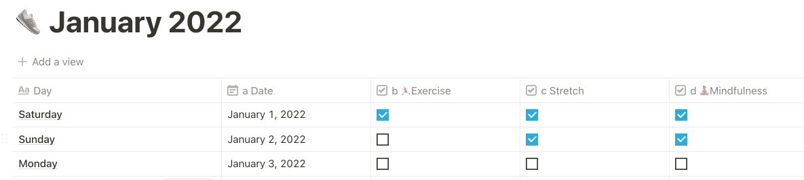
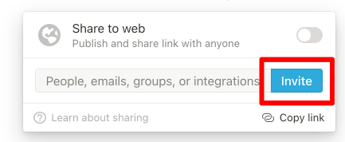
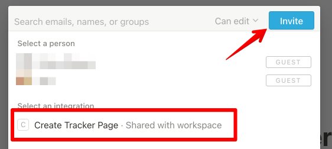
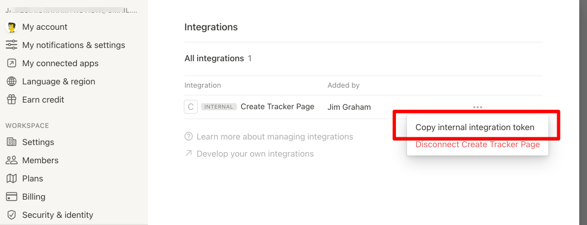

# `notion-tracker-create`

a Notion API integration to create Atomic Habits style tracker

## _Atomic Habits_ and the point of this?

I was lucky enough to see a virtual presentation by James Clear on his book [_Atomic Habits_](https://jim-graham.net/books/atomic-habits). During the presentation I was chatting with coworkers via Slack and shared that I had created a version of his habit tracker in Notion.so



Some folks asked me to share. Instead I created this script to create the tracker programmatically.

If you just need the trackers, I've [shared them on Notion](https://jimgraham.notion.site/Public-Habit-Trackers-01ca41b1588e41bab650fb0d49b0c998)

## The Notion API

Notion has an [API](https://developers.notion.com/docs/getting-started) to read, create, and modify database, pages and blocks. It appears to be in beta, and is a bit hard to use. Lots of nested arrays and dictionaries.

### Ruby client

The folks at [Orbit](https://orbit.love/) have created a [Ruby wrapper client](https://github.com/orbit-love/notion-ruby-client). Similar clients exist for [python](https://github.com/minwook-shin/notion-database).

The ruby client just wraps the API calls. It doesn't create objects that represent Notion objects.

## To use

### Clone this repo

`git clone git@github.com:jimgraham/notion-tracker-create.git`

### Install the dependencies

The script depends on the Ruby client. To install, run

```bash
bundle install
```

### Create an integration in Notion

The Notion API seems to only work through an "integration" tied to a particular workspace. The Notion API documents [detail how to create an integration](https://developers.notion.com/docs/getting-started#step-1-create-an-integration)

### Create a parent page

Create a parent page in Notion to which the trackers will be added. I created ["Public Habit Trackers"](https://jimgraham.notion.site/Public-Habit-Trackers-01ca41b1588e41bab650fb0d49b0c998).

### Add the integration to the parent page

Using the "Share" button, add the integration to this page




### Modify the code to add the columns you need


### run

From the command line, run the integration like:

```bash
> NOTION_API_TOKEN=<integration_secret_token> NOTION_PARENT_ID=<32-char-id> ruby create_tracker.rb
```

The two inputs are
- `NOTION_API_TOKEN`: this is the secret token used to identify your integration to Notion. You can find it in your settings. It typically starts with `secret_`



- `NOTION_PARENT_ID`: this is the identifier of the page under which the tracker will be created. It is a 32 character unique identifier. You can retrieve it from the URL of the page.
    - _e.g._ `https://jimgraham.notion.site/Public-Habit-Trackers-01ca41b1588e41bab650fb0d49b0c998` the ID is `01ca41b1588e41bab650fb0d49b0c998`

## Gotchas

The API is not fully-formed, so some of the things I wanted to do were not available. For example,

1. API columns are alphabetically sorted, so I had to add a prefix (_e.g._ "a Date", "b Exercise"). You will have to edit the columns afterwards to remove these (the order will be preserved)
2. Can't add the "Calculate" programmatically. One nice feature of having the check list in Notion is that you can add a "Calculate" function to each column. You can add "Percentage checked" and get a percentage of how many days you did the action. This is not available to be set in the API.


